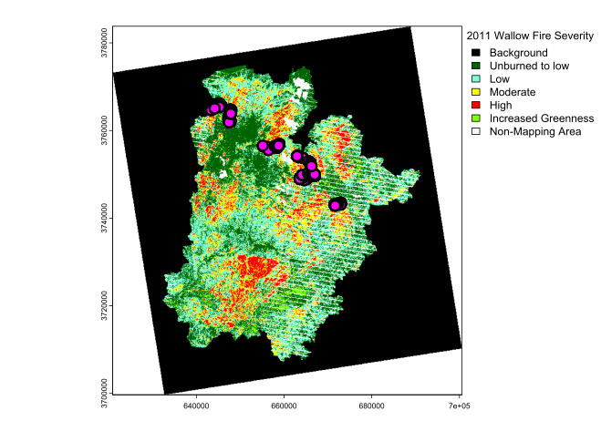
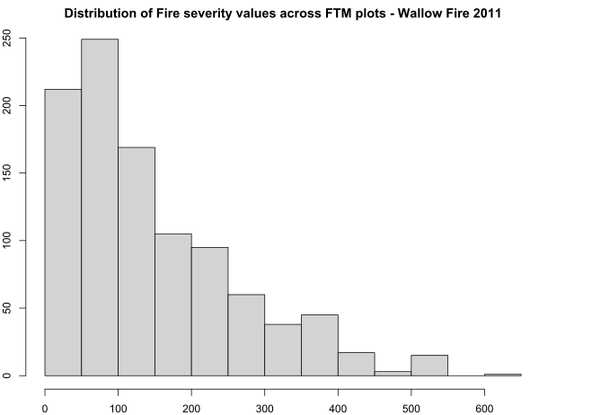

# Fire-Mortality-Model
Parameterizing an empircal model of species-specfic, fire-induced tree mortality for the Southwest U.S. 

Here, we use plot-level tree mortality records from the Fire & Tree Mortality Database (Cansler et al. 2022) <a href="https://www.fs.usda.gov/rds/archive/catalog/RDS-2020-0001-2">Fire and tree mortality database</a>

``` r
library(data.table)
library(dplyr)
library(tigris)
library(ggplot2)
library(sf)
library(raster)
library("tidyverse")

# Read in Study Area Boundary
fri <- sf::st_read("../boundaries/4FRI_Dissolved.gpkg")
plot(fri$geom)

# Read in all 4FRI area
all_fri <- sf::st_read("../boundaries/4FRI_CFLR_InitiativeArea.gdb")
plot(all_fri$SHAPE)

# Read in Wallow Fire plots
W_sf <- sf::st_read("./NAU_fire_mort/Wallow/Wallow.gpkg")
plot(W_sf)

# Read in Leroux Fire plots 
L_sf <- sf::st_read("./NAU_fire_mort/Wallow/Leroux.gpkg")
plot(L_sf)

# Read in San Juan Fire plots
SJ_sf <- sf::st_read("./NAU_fire_mort/Wallow/SJ.gpkg")
plot(SJ_sf)

### PLOT STATES WITH NAU SF OBJECTS

us_states <- states(cb = TRUE, resolution = "20m") %>%
  shift_geometry()%>%
  sf::st_transform(st_crs(W_sf))

AZ <- us_states[us_states$STUSPS == "AZ",]

ggplot() +
  geom_sf(data=AZ) +
  geom_sf(data=all_fri, col='purple') +
  #geom_sf(data=fri) +
  geom_sf(data=W_sf, col = "red", size =2) +
  geom_sf(data=L_sf, col = "blue", size =2) +
  geom_sf(data=SJ_sf, col = "forestgreen", size =2)

```
<!-- -->

```r
# Read in MTBS fire severity maps for the 2011 Wallow Fire
W_dnbr6 <- terra::rast("C:/Users/andre/Desktop/4FRI_practice/SCRPPLE/FireDataBundles/2011/az3360210944920110529_20110514_20120524_dnbr6.tif") %>%
  terra::project("+proj=utm +zone=12")

# Plot the fire severity class map with locations of FTM monitoring plots 
cls <- data.frame(value=0:6, category=c("Background","Unburned to low","Low",
                                        "Moderate","High","Increased Greenness",
                                        "Non-Mapping Area"))
levels(W_dnbr6) <- cls
plot(W_dnbr6, all_levels=T,
     plg=list( # parameters for drawing legend
       title = "2011 Wallow Fire Severity",
       #title.cex = 2, # Legend title size
       cex = 1.25 # Legend text size
     ))
plot(st_geometry(W_sf), pch = 21, cex =2,col = 'black', bg='magenta' , lwd=3, add = T)

```

<!-- -->

```r
# Extract plot-level dnbr values 
W_dnbr <- terra::rast("C:/Users/andre/Desktop/4FRI_practice/SCRPPLE/FireDataBundles/2011/az3360210944920110529_20110514_20120524_dnbr.tif")%>%
  terra::project("+proj=utm +zone=12")

W_plots_dnbr <- terra::extract(W_dnbr, W_sf)
W_plots_dnbr$Layer_1 <- as.numeric(W_plots_dnbr$Layer_1)
W_plots_dnbr[1:10,]
summary(W_plots_dnbr$Layer_1)
hist(W_plots_dnbr$Layer_1, main = "Distribution of Fire severity values across FTM plots - Wallow Fire 2011")

# Rename dnbr value column
colnames(W_plots_dnbr)[2] <- "dnbr"
W_plots_dnbr[1:10,]

# Add an ID column (row number) for a merge to the extracted values
# Row numbers should match order of extracted value table 
W_sf <- W_sf %>% mutate(id = row_number())
names(W_sf)
colnames(W_sf)[25] <- "ID"

# Merge extracted dnbr / fire severity plot values to FTM data frame 
W_join <- merge(x = W_sf, y = W_plots_dnbr, by = "ID", all = TRUE)

```
<!-- -->
